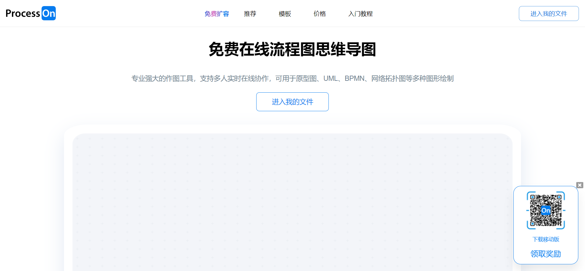
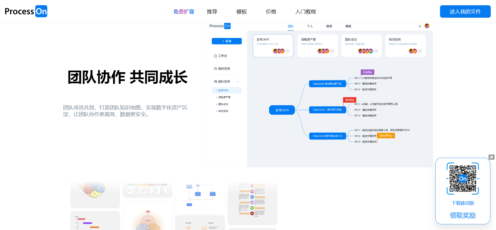
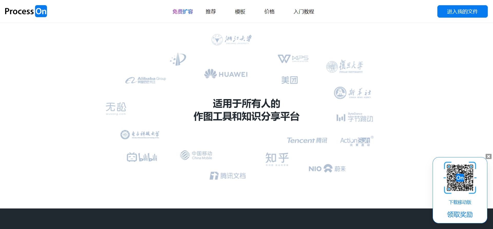
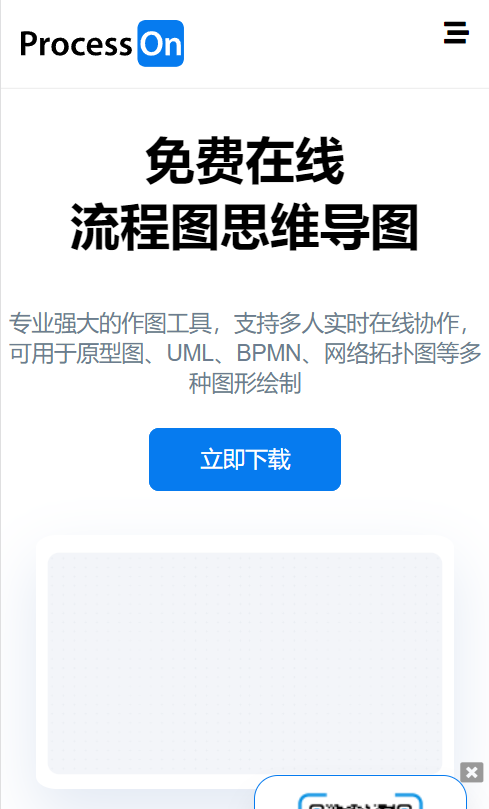
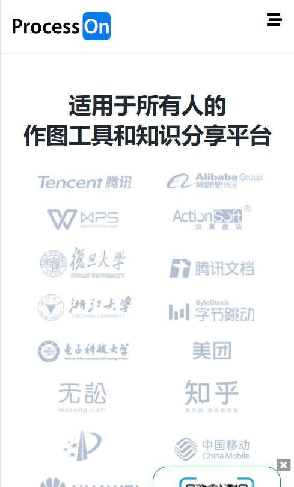
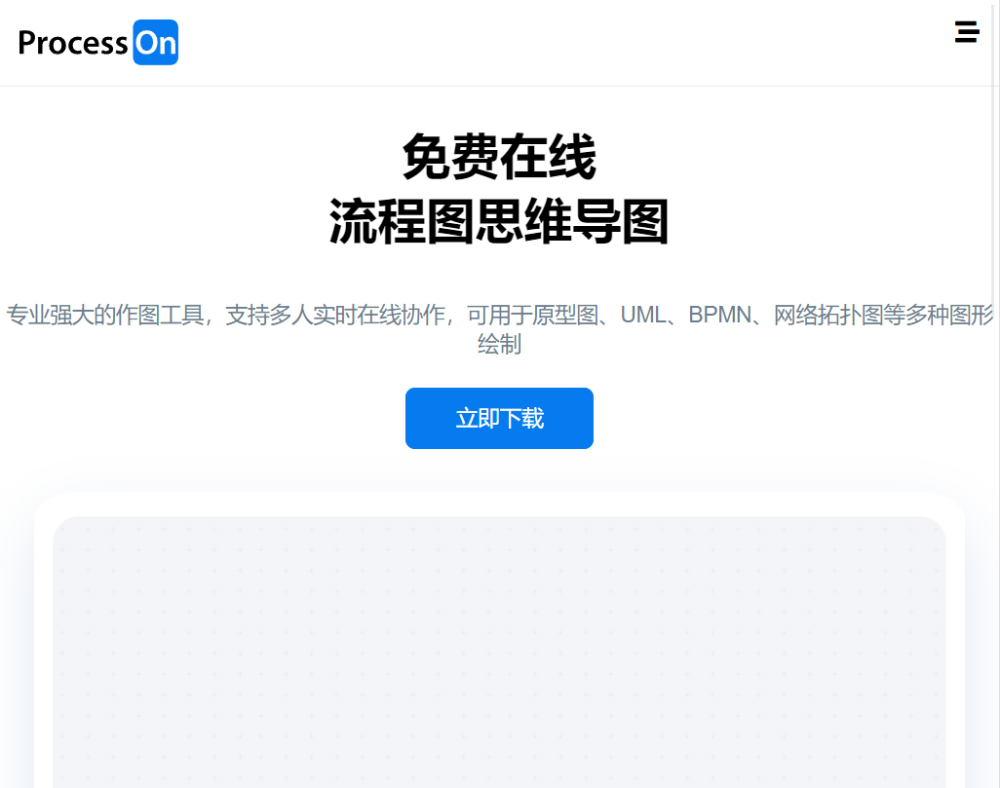
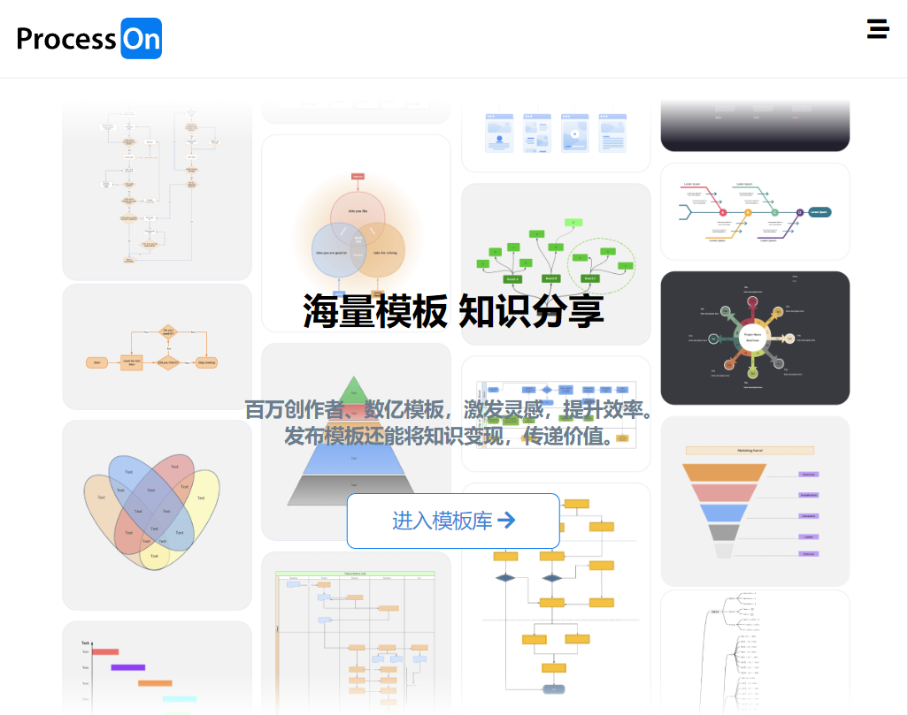
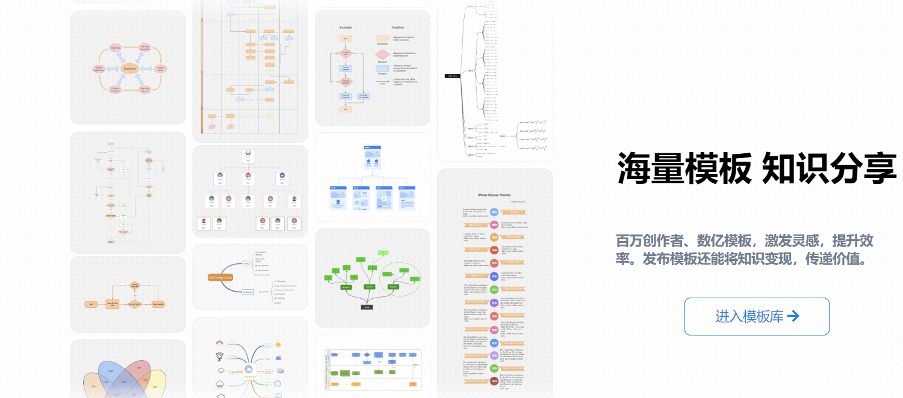
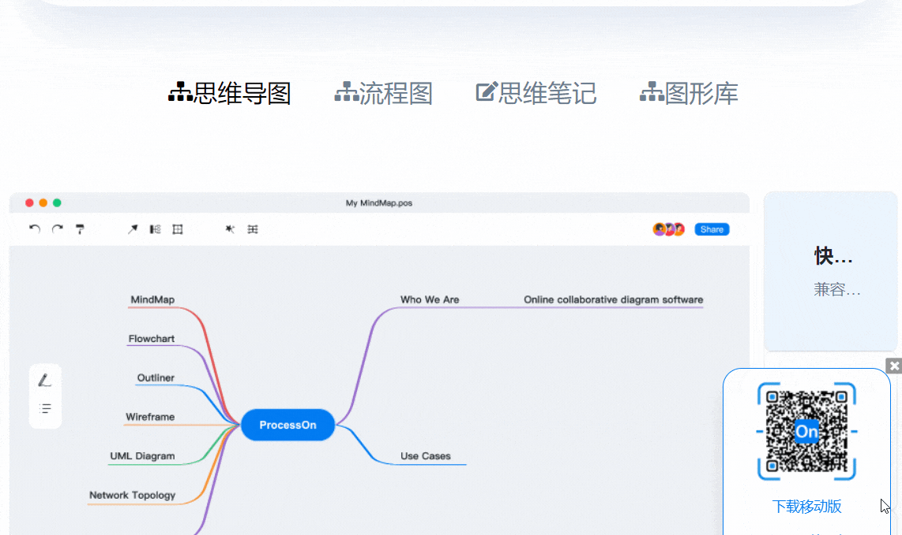

### ProcessOn的主页的前端页面(less+jquery实现三端)

* 很基础的一个网站,没有什么特别的技术(懒加载也没有)
* 手机端,苹果端,PC端都通用,具体可以试试
* 不过有些小bug,那个图片滚动的,可能有些bug
* 拿来做课程设计还是OK的吧~

### 展示

#### PC端

#### 手机端(浏览器测试)

#### 平板端(浏览器测试)

### 头部渐变效果("免费扩容"这几个字)

#### 滚动列表效果

#### 底部出现效果

#### 一些改变时候的过渡

### 下载地址

[ProcessOn官网前端页面](https://github.com/superBiuBiuMan/processon_html_project)
